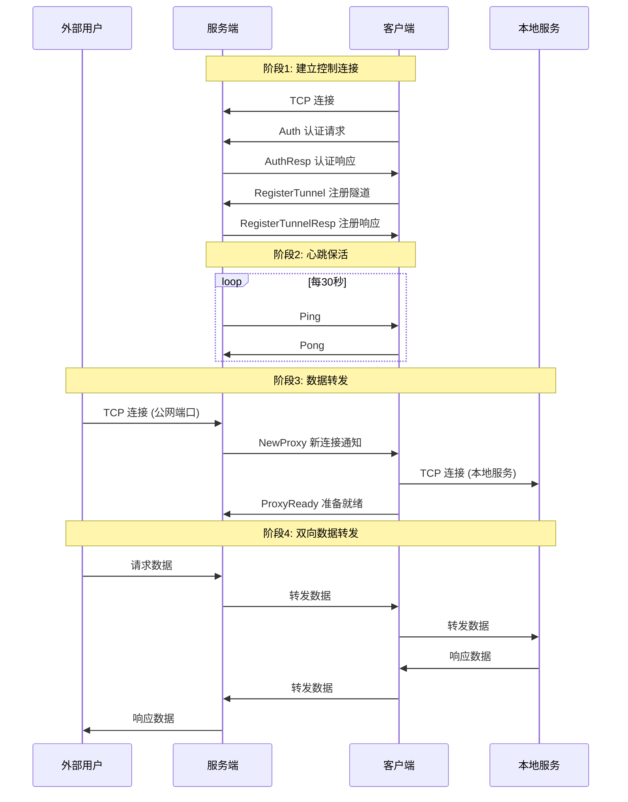

# 系统架构设计

## 1. 整体架构

### 1.1 架构图

```
                                    公网服务器
                          ┌─────────────────────────────┐
                          │      go-tunnel-server       │
                          │                             │
    外部用户              │  ┌───────────────────────┐  │
        │                 │  │    控制端口 :7000     │  │         内网
        │                 │  │   (Control Port)      │  │           │
        │                 │  └───────────┬───────────┘  │           │
        │                 │              │ 控制连接      │           │
        │                 │              │ (认证/心跳)   │           │
        │                 │              ▼              │           │
        │   HTTP请求      │  ┌───────────────────────┐  │    ┌──────┴──────┐
        ├────────────────►│  │    公网端口 :8080     │  │    │ go-tunnel-  │
        │                 │  │   (Public Port)       │  │    │   client    │
        │                 │  └───────────┬───────────┘  │    └──────┬──────┘
        │                 │              │              │           │
        │                 │              │ 数据转发      │           │
        │                 │              ▼              │           ▼
        │                 │  ┌───────────────────────┐  │    ┌─────────────┐
        │◄────────────────┤  │     数据通道          │◄─┼───►│  本地服务    │
        │   HTTP响应      │  │   (Data Channel)      │  │    │ 127.0.0.1:  │
        │                 │  └───────────────────────┘  │    │    8080     │
        │                 │                             │    └─────────────┘
        │                 └─────────────────────────────┘
        │
   公网用户 
```

### 1.2 架构说明

系统采用**控制连接 + 数据连接分离**的架构：

| 连接类型 | 作用 | 生命周期 |
|----------|------|----------|
| **控制连接** | 客户端认证、隧道注册、心跳保活 | 长连接，与客户端生命周期一致 |
| **数据连接** | 实际业务数据转发 | 短连接，按需建立 |

**设计理由：**
1. 控制连接保持稳定，减少重连开销
2. 数据连接按需创建，资源利用更高效
3. 控制通道与数据通道隔离，便于管理和调试

## 2. 数据流详解

### 2.1 完整数据流程



### 2.2 各阶段详解

#### 阶段1：建立控制连接

1. **TCP 连接**：客户端主动连接服务端控制端口
2. **认证**：客户端发送 Token 和 ClientID，服务端验证
3. **注册隧道**：客户端逐个注册需要的隧道配置

```
为什么客户端主动连接？
- 客户端在内网，通常无法被公网访问
- 主动连接可穿透大多数 NAT 设备
- 长连接保持后，双向通信成为可能
```

#### 阶段2：心跳保活

1. **服务端定时发送 Ping**：检测客户端是否在线
2. **客户端回复 Pong**：证明连接存活
3. **超时处理**：超过阈值未收到响应，断开连接

```
为什么需要心跳？
- NAT 设备会清理长时间无数据的连接
- 及时检测网络故障，清理无效会话
- 防止"半开连接"占用资源
```

#### 阶段3：数据转发

1. **用户连接公网端口**：服务端监听的代理端口
2. **通知客户端**：发送 NewProxy 消息，包含唯一 ProxyID
3. **客户端建立双向连接**：
   - 连接本地服务（如 127.0.0.1:8080）
   - 新建到服务端的数据连接
4. **确认就绪**：发送 ProxyReady 消息

```
为什么使用新的数据连接？
- 控制连接承载协议消息，数据连接承载原始数据
- 避免消息边界混淆
- 支持多路并发数据转发
```

## 3. 核心组件

### 3.1 服务端组件

```
┌─────────────────────────────────────────────────────────────┐
│                        Server                                │
├─────────────────────────────────────────────────────────────┤
│                                                             │
│  ┌─────────────┐   ┌─────────────┐   ┌─────────────┐       │
│  │   Config    │   │   Logger    │   │  Sessions   │       │
│  │   配置管理   │   │   日志记录   │   │  会话管理   │       │
│  └─────────────┘   └─────────────┘   └─────────────┘       │
│                                                             │
│  ┌───────────────────────────────────────────────────┐     │
│  │                   Accept Loop                      │     │
│  │                   连接接受循环                      │     │
│  │  - 监听控制端口                                    │     │
│  │  - 接受新连接                                      │     │
│  │  - 创建会话协程                                    │     │
│  └───────────────────────────────────────────────────┘     │
│                                                             │
│  ┌───────────────────────────────────────────────────┐     │
│  │                 Client Session                     │     │
│  │                 客户端会话                          │     │
│  │  - 认证处理                                        │     │
│  │  - 隧道注册                                        │     │
│  │  - 消息循环                                        │     │
│  │  - 心跳检测                                        │     │
│  └───────────────────────────────────────────────────┘     │
│                                                             │
└─────────────────────────────────────────────────────────────┘
```

| 组件 | 职责 | 实现文件 |
|------|------|----------|
| **Server** | 服务端主结构，管理整体生命周期 | `internal/server/server.go` |
| **ClientSession** | 单个客户端会话，独立处理 | `internal/server/server.go` |
| **Accept Loop** | 监听并接受新连接 | `Server.acceptLoop()` |
| **Message Loop** | 处理会话消息 | `Server.handleSession()` |
| **Heartbeat Loop** | 心跳检测 | `Server.heartbeatLoop()` |

### 3.2 客户端组件

```
┌─────────────────────────────────────────────────────────────┐
│                        Client                                │
├─────────────────────────────────────────────────────────────┤
│                                                             │
│  ┌─────────────┐   ┌─────────────┐   ┌─────────────┐       │
│  │   Config    │   │   Logger    │   │   Connect   │       │
│  │   配置管理   │   │   日志记录   │   │  控制连接   │       │
│  └─────────────┘   └─────────────┘   └─────────────┘       │
│                                                             │
│  ┌───────────────────────────────────────────────────┐     │
│  │                  Start Flow                        │     │
│  │                  启动流程                           │     │
│  │  1. connect()       - 建立TCP连接                  │     │
│  │  2. authenticate()  - 发送认证                     │     │
│  │  3. registerTunnels() - 注册隧道                   │     │
│  │  4. messageLoop()   - 启动消息循环                 │     │
│  │  5. heartbeatLoop() - 启动心跳循环                 │     │
│  └───────────────────────────────────────────────────┘     │
│                                                             │
│  ┌───────────────────────────────────────────────────┐     │
│  │                Proxy Handler                       │     │
│  │                代理处理器                           │     │
│  │  - handleNewProxy()  处理新代理请求                │     │
│  │  - proxyData()       双向数据转发                  │     │
│  └───────────────────────────────────────────────────┘     │
│                                                             │
└─────────────────────────────────────────────────────────────┘
```

| 组件 | 职责 | 实现文件 |
|------|------|----------|
| **Client** | 客户端主结构，管理整体生命周期 | `internal/client/client.go` |
| **Message Loop** | 接收并处理服务端消息 | `Client.messageLoop()` |
| **Heartbeat Loop** | 定时发送心跳 | `Client.heartbeatLoop()` |
| **Proxy Handler** | 处理代理请求和数据转发 | `Client.handleNewProxy()` |

### 3.3 共享组件

| 包 | 职责 | 说明 |
|-----|------|------|
| **pkg/config** | 配置加载与验证 | 支持 YAML 格式，提供默认值 |
| **pkg/connect** | TCP 连接封装 | 消息级读写、超时处理、并发安全 |
| **pkg/log** | 日志模块 | 基于 slog，支持结构化日志 |
| **pkg/proto** | 通信协议 | 消息定义、编解码、类型常量 |

## 4. 并发模型

### 4.1 服务端并发

```
Main Goroutine
    │
    ├─► Accept Loop (1个)
    │       │
    │       ├─► Session Goroutine (每客户端1个)
    │       │       │
    │       │       ├─► Message Loop
    │       │       └─► Heartbeat Loop
    │       │
    │       └─► Session Goroutine ...
    │
    └─► Signal Handler (等待退出信号)
```

**设计理由：**
- 每个客户端独立协程，互不影响
- 协程轻量（约 2KB 栈空间），支持大量并发
- 使用 channel 进行协程间通信，避免锁竞争

### 4.2 客户端并发

```
Main Goroutine
    │
    ├─► Message Loop (1个)
    │       │
    │       └─► Proxy Handler (每代理请求1个)
    │               │
    │               ├─► Local→Remote Goroutine
    │               └─► Remote→Local Goroutine
    │
    ├─► Heartbeat Loop (1个)
    │
    └─► Signal Handler (等待退出信号)
```

**设计理由：**
- 消息循环单协程，保证消息顺序处理
- 代理处理异步，不阻塞消息循环
- 双向转发各自独立，最大化吞吐

## 5. 关键设计决策

### 5.1 为什么使用自定义二进制协议？

| 方案 | 优点 | 缺点 |
|------|------|------|
| HTTP/WebSocket | 标准协议，易穿透防火墙 | 额外协议开销，不适合高频消息 |
| gRPC | 高效，自动生成代码 | 需要 protobuf，依赖较重 |
| **自定义二进制** | 最小开销，完全可控 | 需要自己实现编解码 |

**选择自定义二进制协议的理由：**
1. 内网穿透场景对延迟敏感，需要最小开销
2. 消息结构简单固定，不需要复杂序列化
3. 便于学习和二次开发

### 5.2 为什么消息体使用 JSON？

虽然消息头使用二进制，但消息体使用 JSON：

1. **调试友好**：可以直接打印和查看消息内容
2. **扩展灵活**：添加字段不影响旧版本（向前兼容）
3. **性能足够**：消息体通常较小（< 1KB），JSON 开销可接受

### 5.3 为什么控制连接与数据连接分离？

1. **职责清晰**：控制协议只处理管理消息
2. **避免混淆**：原始数据不需要分帧处理
3. **资源隔离**：控制连接问题不影响已建立的数据通道
4. **更易扩展**：未来可独立优化两类连接

### 5.4 为什么使用端口白名单？

1. **安全控制**：防止客户端随意占用服务器端口
2. **资源管理**：限制可用端口范围
3. **合规要求**：某些端口可能有特殊用途或限制
4. **灵活配置**：空白名单时允许所有端口（开发环境友好）
